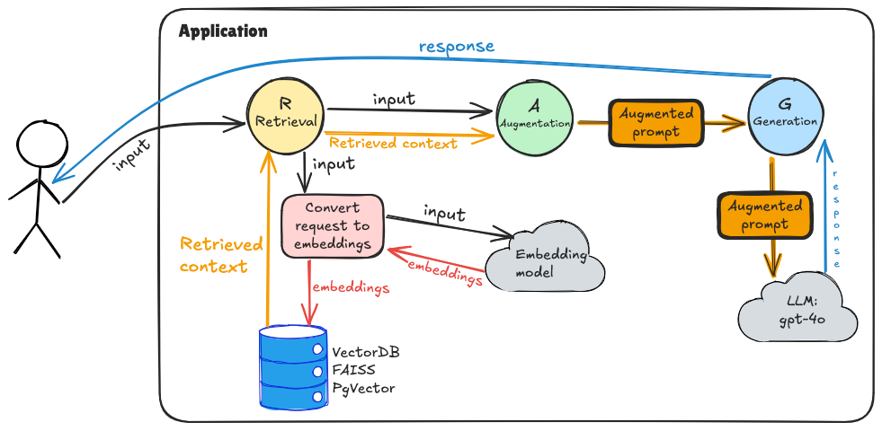

# RAG (Retrieval-Augmented Generation) Implementation

A Python implementation task to build a complete RAG system for microwave manual assistance using LangChain, FAISS, and Azure OpenAI

## 🎓 Learning Goals

By completing this task, you will learn:
- How to implement the complete RAG pipeline: **Retrieval**, **Augmentation**, and **Generation**
- How to work with vector embeddings and similarity search using FAISS

## 📋 Requirements

- Python 3.11+
- pip
- API key for DIAL service

## 🔧 Setup

1. **Install dependencies:**
   ```bash
   pip install -r requirements.txt
   ```

2. **Set your API key:**
   - Ensure that you connected to the EPAM VPN
   - Get the DIAL API key here: https://support.epam.com/ess?id=sc_cat_item&table=sc_cat_item&sys_id=910603f1c3789e907509583bb001310c
   - Update `task/_constants.py` with your API credentials
   - Get available models from: https://ai-proxy.lab.epam.com/openai/models

3. **Project structure:**
   ```
   task/
   ├── _constants.py                # ✅ API configuration
   ├── microwave_manual.txt         # ✅ Knowledge base document
   └── app.py                       # 🚧 TODO - Your main implementation
   ```
## 🖌️ Application diagram:



## 📝 Your Task

### If the task in the main branch is hard for you, then switch to the with-detailed-description branch

Complete the implementation in `app.py` by filling in all the TODO sections:

### 🔍 **Step 1: Vector Store Setup (`_setup_vectorstore` method)**
- Check if FAISS index already exists locally
- Load existing index or create new one
- Handle both scenarios properly

### 📖 **Step 2: Document Processing (`_create_new_index` method)**
- Load the microwave manual text file
- Split documents into chunks using RecursiveCharacterTextSplitter
- Create FAISS vector store from document chunks
- Save the index locally for future use

### 🔎 **Step 3: Context Retrieval (`retrieve_context` method)**
- Implement similarity search with relevance scores
- Extract and format relevant document chunks
- Return formatted context for the LLM

### 🔗 **Step 4: Prompt Augmentation (`augment_prompt` method)**
- Format the user prompt with retrieved context
- Structure the prompt according to the RAG template

### 🤖 **Step 5: Answer Generation (`generate_answer` method)**
- Create proper message structure for the LLM
- Call Azure OpenAI to generate the final answer
- Return the generated response

### ⚙️ **Step 6: Main Configuration**
- Set up Azure OpenAI embeddings client
- Configure the chat completion client
- Initialize the RAG system with proper parameters


## 📊 Understanding the RAG Pipeline

Your implementation will demonstrate the complete RAG workflow:

1. **🔍 Retrieval**: Find relevant chunks from the microwave manual based on user query
2. **🔗 Augmentation**: Combine retrieved context with user question in a structured prompt
3. **🤖 Generation**: Use LLM to generate accurate answer based on the provided context

## 🔧 Configuration Parameters

You can experiment with these parameters in the `retrieve_context` method:
- `k`: Number of relevant chunks to retrieve (default: 4)
- `score`: Similarity threshold for chunk relevance (default: 0.3)
- `chunk_size`: Size of document chunks (default: 300)
- `chunk_overlap`: Overlap between chunks (default: 50)

## 📚 Key Concepts Covered

- **Vector Embeddings**: Converting text to numerical vectors for similarity search
- **FAISS**: Efficient similarity search and clustering of dense vectors
- **Document Chunking**: Breaking large documents into manageable pieces
- **Similarity Search**: Finding most relevant content based on query

## 🎯 Testing Your Implementation

### Valid request samples:
``` 
What safety precautions should be taken to avoid exposure to excessive microwave energy?
```
```
What is the maximum cooking time that can be set on the DW 395 HCG microwave oven?
```
```
How should you clean the glass tray of the microwave oven?
```
```
What materials are safe to use in this microwave during both microwave and grill cooking modes?
```
```
What are the steps to set the clock time on the DW 395 HCG microwave oven?
```
```
What is the ECO function on this microwave and how do you activate it?
```
```
What are the specifications for proper installation, including the required free space around the oven?
```
```
How does the multi-stage cooking feature work, and what types of cooking programs cannot be included in it?
```
```
What should you do if food in plastic or paper containers starts smoking during heating?
```
```
What is the recommended procedure for removing odors from the microwave oven?
```

### Invalid request samples:
```
What do you know about the DIALX community?
```
```
What do you think about the dinosaur era? Why did they die?
```

----

# 